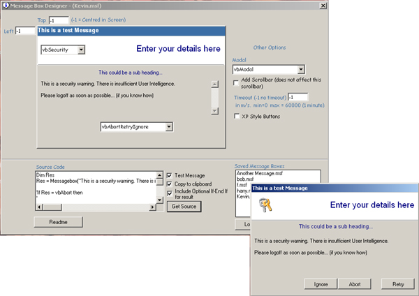



## An Alternative Message Box \(msgbox\)

### Description

This code provides an alternative Messagebox with just 3 additional files to your project. 1 form, 1 module and 1 user control (chameleonButton Button by Conchuki). A complete designer has been included in the demo project which allows GUI design of msgboxes. Different icons, scroll bar, XP/2000 style etc. This was submitted a while ago as a bog standard msgbox by someone but I cannot find out who. Ive included the original.

Please vote if you like it, if you don't, tell me why you don't so I can improve it.

Enjoy!
 
### More Info
 
You need to call one function. Thats it!

YOU NEED TO READ THE READ ME IF YOU ARE A BEGINNER IN ORDER TO GET THIS CUSTOM MESSAGE BOX IN YOUR APP.

Returns the user selected answer

Could bog down your app.

             |
---                |---
**Submitted On**   |2002-08-20 20:35:12
**By**             |[Kevin Figg](https://github.com/Planet-Source-Code/PSCIndex/blob/master/ByAuthor/kevin-figg.md)
**Level**          |Beginner
**User Rating**    |4.6 (46 globes from 10 users)
**Compatibility**  |VB 5\.0, VB 6\.0
**Category**       |[Custom Controls/ Forms/  Menus](https://github.com/Planet-Source-Code/PSCIndex/blob/master/ByCategory/custom-controls-forms-menus__1-4.md)
**World**          |[Visual Basic](https://github.com/Planet-Source-Code/PSCIndex/blob/master/ByWorld/visual-basic.md)
**Archive File**   |[An\_Alterna1203988202002\.zip](https://github.com/Planet-Source-Code/kevin-figg-an-alternative-message-box-msgbox__1-38127/archive/master.zip)

### API Declarations

One global value.

